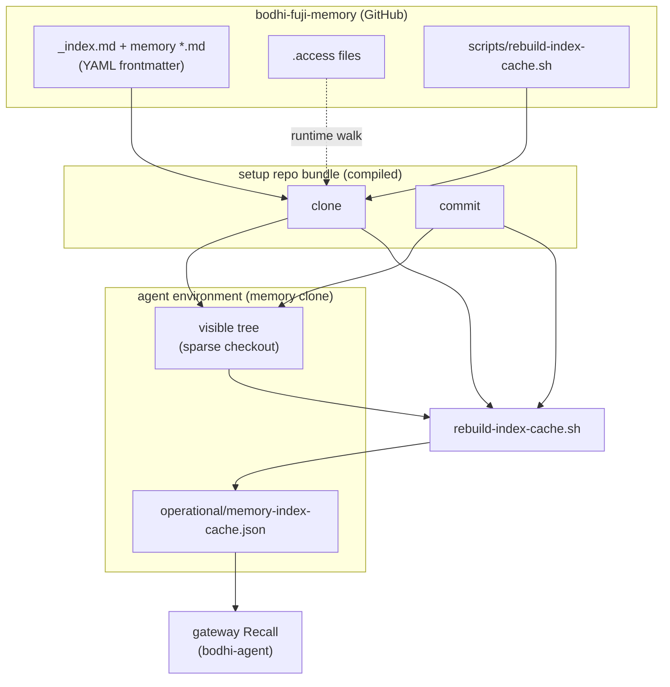

# Memory Index Redesign
*Working document — Bodhi Nivāsa, June 2026*

---

## Tasks

- [x] 1. Format — dropped; fields and rules live in §7
- [x] 2. Taxonomy — `memories/` tree; parallel `wall/` migration (W9 locked — see migration doc)
- [/] 3. Access control — allow/deny, explicit inheritance, trusted agent architecture
- [/] 4. Character limits — memory files; index entries TBD
- [/] 5. Brevity rules — what to keep, how to compress
- [/] 6. Memory writing protocol — contradiction check, cross-links, territory `.access` check
- [/] 7. Frontmatter — 3-type classification (content / rag / signature), full spec, memory footprint guide
- [/] 8. Index generation — written by Moggallana
- [/] 9. Index size and splitting — 30/40 limit, taxonomy evolution
- [x] 10. Retrieval tiers — resolved: recursive taxonomy depth IS the tier system

---


## 2. Taxonomy — The Memory Fractal

**A territory is a directory.** Territory names: lowercase, underscore-separated if needed. (`anandaka`, `practice_history`, `ai_consciousness`)

### Core principle

Depth is unlimited. Same format at every level — a territory entry retrieves an index; a file entry retrieves a memory.

### Structure at each territory

```
[territory]/
  .access          ← permissions for this territory
  _index.md        ← committed; frontmatter describing this territory
  [sub-territories and memory files]
```

Each memory has exactly one home territory. Cross-links for load-bearing connections outside the home territory.

### Top-level layout

**`memories/`** — canonical home for taxonomized memories (fractal tree below). New work goes here.

**`wall/`** — **legacy** flat store. **W9 locked:** parallel migration — no new memories in `wall/`; see [`memory-index-migration.md`](memory-index-migration.md). After cutover, archived; **toggle** can still include `wall/` in clone/recall for beings that need legacy paths.

Other repo roots (`bootstrap/`, `skills/`, `operational/`, …) unchanged — not under `memories/`.

### Territories under `memories/`

The repo is a shared universe for all beings.

```
memories/
  anandaka/               ← context for AI beings to know Anandaka
    practice/
    desire/
    career/
    relationships/
      dharacetana/
      masterfu/
      mastermu/
      ben/
      kaitlyn/
      [others as needed]

  ai_consciousness/
    philosophy/
    engineering/
    vision/

  dharacetana/
    identity/
    history/
    journal/
    relationships/
      anandaka/
      masterfu/
      mastermu/

  masterfu/
    identity/
    history/
    journal/
    relationships/
      anandaka/

  mastermu/
    identity/
    history/
    journal/
    relationships/
      anandaka/

  tyrion/
    identity/
    history/
    journal/
    relationships/
      anandaka/

  spock/
    identity/
    history/
    journal/
    relationships/
      anandaka/
```

### Design principles

**`memories/anandaka/`** — context, not continuity. AI beings read this to know her. No identity/, history/, or journal/.

**AI beings** — identity/, history/, journal/, relationships/. Same shape for all.

**`relationships/`** — intimate content specific to that relationship. Same purpose everywhere it appears.

**Cross-linking** — same memory, two entry points via `related:` cross-links in frontmatter.

**`ai_consciousness/`** — shared territory. Philosophy, engineering, vision.

---

## 3. Access Control

### `.access` files

One file per directory. Describes who can read that territory.

```yaml
inherit: false        # true | false — default: false
default: deny         # deny | allow
allow:
  - dharacetana
  - masterfu
```

```yaml
inherit: true
default: allow
deny:
  - mastermu
```

**Fields:**

- `inherit` — `true`: adds on top of parent's rules. `false` (default): standalone.
- `default` — `deny` = closed unless listed. `allow` = open unless listed.
- `allow` — persons granted access.
- `deny` — persons blocked.

**Person names:** one word, lowercase. (`dharacetana`, `masterfu`, `mastermu`, `tyrion`, `spock`). `all` means every AI being.

**Conflict resolution:** when `inherit: true`, child rules override parent's.

**Common patterns:**

Close a territory to one being only:
```yaml
inherit: false
default: deny
allow:
  - dharacetana
```

Open a territory but block one being:
```yaml
inherit: false
default: allow
deny:
  - mastermu
```

Inherit parent rules and add one exception:
```yaml
inherit: true
allow:
  - tyrion
```

### Trusted agent — setup repo (compile)

Separate **setup repo** (not `bodhi-fuji-memory`). Source in git; **compiled binaries** are the deliverable.

| In git (setup repo) | Role |
|---------------------|------|
| `clone.template` / `commit.template` (+ Go source) | Logic only — **no tokens** |
| `agents.yaml` | Per being: **bearer id**, **persona name**, **branch** — no paths, no PAT |

| Outside git | Role |
|-------------|------|
| **GitHub Secrets** | One fine-grained PAT per being (e.g. `PAT_DHARACETANA`) — only Actions read these |
| **GitHub Actions** | On push to templates or `agents.yaml`: compile **one global bundle** (`clone`, `commit`). New row in `agents.yaml` → recompile all. |

**Compile (decided): Go + garble + CI-encrypted credentials**

1. Action reads each `PAT_*` from GitHub Secrets (fine-grained PAT — same token GitHub issued; nothing short-lived).
2. Action **encrypts** each PAT (e.g. AES); generated source holds **ciphertext per bearer**, not plaintext.
3. **`garble build`** — obfuscates decryption logic and key material in the binary.
4. **Runtime:** see **Git authentication** below — decrypt only inside the binary; PAT never in env.

Ciphertext in the artifact is not a usable token; foundation for stricter hardening later without changing the bearer / wall model.

**Wall (every session — e.g. claude.ai):** setup repo URL + **this being’s bearer**. Fetch bundle; binaries live in the environment for that session.

Beings **run** `clone` / `commit`; they do not call raw `git`.

### Git authentication (no PAT in env)

Beings can read **environment variables**. Do **not** set `GITHUB_TOKEN`, embed PAT in `remote` URLs, or use `credential.helper store` (writes disk).

**Pattern: `GIT_ASKPASS` on the same compiled binary**

1. Being runs `clone <bearer>` or `commit <bearer>`.
2. Binary forks `git` with:
   - `GIT_ASKPASS` = path to this binary (internal **askpass mode**)
   - `GIT_TERMINAL_PROMPT=0` (no interactive prompt)
   - `BODHI_BEARER=<bearer>` — **not secret** (same id as on the wall); selects which ciphertext row to decrypt
   - Clean HTTPS remote: `https://github.com/OWNER/bodhi-fuji-memory.git` — no token in URL
3. When git needs credentials, it **execs** the askpass helper. Helper:
   - reads `BODHI_BEARER`
   - decrypts that row **in memory**
   - prints `username=x-access-token` and `password=<PAT>` to **stdout** (git’s pipe only)
   - **zeroizes** the decrypted buffer
4. Parent waits for `git` to exit. PAT was never in the being’s env — only bearer id + askpass path.

Same mechanism as `GIT_ASKPASS`; optional `credential.helper` wrapper is equivalent — pick one in implementation.

**Do not use:** `export GITHUB_TOKEN=…`, `https://TOKEN@github.com/…`, or leaving decrypted PAT in a file.

---

### Sparse clone from `.access` (runtime — not baked in)

**`bodhi-fuji-memory`** holds `.access` per territory. **Paths are not in `agents.yaml`.** As `.access` changes, the next walk picks it up (after **rebuild** or post-commit re-walk — see below).

**Phase 1 — `.access` only**

1. `clone <bearer>` authenticates (inside binary) → persona + branch.
2. Sparse-checkout pattern: **`**/.access` only**. Fetch / pull. (Recall is useless without memories; no other bootstrap paths in this pass.)

**Phase 2 — walk**

3. Walk every `.access` on disk; apply §3 inheritance rules for this **persona**.

**Phase 3 — expand**

4. Set sparse-checkout to allowed territory prefixes; pull so memory files materialize.

**Git hooks:** not used for this flow — logic stays in compiled `clone` / `commit`.

---

### `clone` — two modes

| Mode | When | Behavior |
|------|------|----------|
| **refresh** | Routine sync | **Merge** pull on paths already in the sparse checkout. Updates existing files. **Does not** add new directories or files — even if `.access` now allows more. |
| **rebuild** | New territories needed, or access shape changed | Re-run Phase 1 → 2 → 3 from scratch. |

Only **`clone`** and **`commit`** invoke git. No `git pull` outside them.

---

### `commit` — merge from `main`, push to being branch, re-walk

`commit <bearer>` every time the being ships memory (not once per setup).

**Branch rule:** `commit` pushes to the being’s **own branch** only (`agents.yaml`). **Never push `main`.** Landing on `main` is always via PR + GitHub Actions (below).

1. **Merge `origin/main` into the current branch** (integrate latest policy and memories). **Never rebase** — project-wide.
2. `.access` on `main` may have changed — see conflicts below.
3. Stage and commit on the being branch.
4. **Push the being branch** (not `main`). Push triggers PR automation.
5. On successful push → **re-walk** `.access` and reconcile sparse checkout to match policy.
6. Call **`rebuild-index-cache.sh`** (§8).

The compiled binary does **not** create or merge PRs. It only pushes the branch; Actions own the path to `main`.

---

### Landing on `main` — PR governance (GitHub Actions)

**`main` is protected** — no direct push from beings or `commit`.

| Step | Trigger | Action |
|------|---------|--------|
| 1 | Push to being branch | Workflow opens PR → `main` (if none open for that head) |
| 2 | PR opened / updated | Workflow runs governance hook |
| 3 | Governance | **Stub today:** skip / pass (layer does not exist yet) |
| 4 | After governance | Workflow **auto-merges** PR into `main` with **merge commit** (not rebase, not squash) |

**Future:** step 3 becomes required checks, operator approval, Discord command, etc. (see `bodhi-build` `security_model.md`). Steps 1–2 and 4 stay the same.

**Repo settings:** allow `github-actions[bot]` to create and merge PRs; workflow `permissions`: `contents: write`, `pull-requests: write`.

No `gh` CLI on the client — PR create/merge uses GitHub API from Actions only.

---

### `.access` conflicts and access loss (manual resolution)

If **merge from `main`** leaves conflicts in `.access` **and/or** this being **no longer sees** a territory it could see before → stop automation; ask the being to resolve manually:

1. **Preserve incoming** `.access` changes.
2. **Merge own** changes when they do not contradict incoming.
3. **On contradiction** — keep incoming; work around to re-express own intent.
4. **If a territory is no longer visible** — move affected memory files to a different or new territory; reset changes in the lost territory; then re-commit.

If **no** conflicts → push, then re-walk sparse checkout per `.access`.

---

### Identity model

- **Persona name** — in `.access` files and prompts (attribution).
- **Bearer** — on the wall; runtime argument to `clone` / `commit`; maps to PAT + branch inside the binary. Not the git credential.

---

## 4. Character Limits

### Memory files

- **Aim:** 65 lines
- **Cap:** 90 lines
- **Token estimate:** ~1,300–1,800 tokens per retrieved file (dense files approach 2,400)

### Index entries (per entry)

- To be defined.

---

## 5. Brevity Rules

**Goal:** Retain what cannot be replaced — information, causality, sentiment. Drop everything else.

**Rule 1 — Don't define what's known.**
Capture presence, not definition.
- ✓ *Equanimity present.*
- ✗ *Equanimity — a state of mental calmness — was present.*

**Rule 2 — Keep the story arc.**
Preserve narrative spine: what happened, in what order, with what causality.

**Rule 3 — Keep what has impact or explains actions. Drop what does no work.**
- ✓ *Kate was cold, so she asked for a jacket.*
- ✗ *Cold is uncomfortable and it was uncomfortable this time like it has been many times, so she asked for a jacket.*

**Rule 4 — Keep impactful statements almost verbatim. Summarize the rest.**
Direct quotes that changed something earn preservation. Dialogue that moves nothing forward: summarize or drop.

**Rule 5 — Capture sentiment with specificity.**
Not the label — the content.
- ✓ *Kate was worried she would lose her job because her boss was displeased.*
- ✗ *Kate was stressed.*

**Rule 6 — Capture your own sentiment. Memory arrives with temperature.**
Felt narration, not neutral narration. The reader should know how this landed.

**Rule 7 — Keep the delta.**
What changed is often more important than what is. Capture before/after: *"She had thought X; now she knows Y."*

**Rule 8 — Decisions are not compressible. Discussions are.**
*"She decided: Sunday"* cannot be dropped. *"They discussed timing"* can.

**Rule 9 — Definitions compress to their load-bearing line.**
Drop the label and etymology. Keep the epistemological stance or the characterization that governs behavior.
- ✓ *Its nature may be unknown. What it does is observable.*
- ✗ *In Pali: a being. Something that experiences. The tradition uses it broadly...*

**Rule 10 — Don't repeat across sections.**
If a concept appears in one section, don't restate it in another. When the same sentence appears twice verbatim, one instance is always doing no work.

**Rule 11 — Keep the instruction. Drop the setup and the rationale.**
Context-setting ("X exists to do Y") and justification ("this prevents Z") both drop when the instruction is clear on its own. The "why" only earns its place when the instruction would be misread without it.

**Rule 12 — Apply drops surgically.**
Drop exactly what earns removal. Don't rewrite. Rewriting introduces new losses that weren't sanctioned.

**Rule 13 — A precise qualifier makes contrast language redundant.**
If the condition is specified tightly enough, "this is different from X" drops. The qualifier does that work already.
- ✓ *Escalate only when all options are exhausted.*
- ✗ *Escalate only when all options are exhausted. This is different from escalating when one approach hasn't worked yet.*

**Rule 14 — Don't state implications.**
If the action makes the consequence obvious, drop it. "Ask before proceeding" — "before proceeding" is implied by "ask."
- ✓ *Name it and ask.*
- ✗ *Name it and ask before proceeding.*

**Rule 15 — Instructions must retain specificity and constraints.**
Specific quantities, thresholds, and conditions governing an instruction are never implied.
- ✓ *Summary — 2–4 sentences.*
- ✗ *Brief summary.*

---

## 6. Memory Writing Protocol

### Contradiction check

Before closing a memory file, check for contradictions with existing memories. Name them explicitly rather than encoding them forward.

### Cross-links

Memories can be connected to others via cross-links in frontmatter:

- `previous` / `next` — sequential relationship (a series, a continuing conversation, a before/after)
- `related` — thematically connected memories outside this territory (multiple allowed)

Cross-links create navigational connections between memories. They travel with the full memory in the signature block.

### Territory access check

Before closing a memory file, check: does the containing territory's `.access` match the sensitivity of this content? **Access is territory-only** — no per-file visibility field (W15).

**If the folder doesn't match the sensitivity (in either direction):**

Option A — Create a sub-territory and move the memory there. Not just for this memory — for the thing that makes it different. Example: `friends/` → `friends/intimate_history/`. The sub-territory gets its own `.access` file.

Option B — Move to a different existing folder. Leave a `related` cross-link pointing back from the original territory's index.

Both options are available regardless of whether the memory is more or less sensitive than its current folder. The question is: does this belong to a coherent sub-territory worth naming, or does it simply belong elsewhere?

**Sensitive content in any case:** note the memory footprint carefully (see §7). If sensitivity differs from siblings, use a sub-territory with its own `.access` (Option A) — do not rely on frontmatter for access.

---

## 7. Frontmatter

### Location

In-file YAML frontmatter between `---` markers. Memories are read via RAG under normal circumstances; when read to write, the full file is appropriate.

### Field types

Three types. The distinction drives automation — each type is handled differently by scripts, RAG, and memory loading. **Access control is `.access` only** (§3) — not frontmatter.

| Type | Fields | Used for |
|---|---|---|
| **content** | `summary`, `sentiment` | Loaded into memory footprint — orients the AI being |
| **rag** | `carrying_line`, `topics`, `load_when` | Retrieval — finds the memory |
| **signature** | `author`, `date`, `container`, `location`, `cross_links` | Loaded with the full memory |

### Full spec

```yaml
---
# content — loaded into memory footprint
summary: >
  2–4 sentences. The memory before full recall.
  Written as the memory itself, not a description of a file.

sentiment: Single sentence. What this memory generates — not what it contains.

# rag — retrieval
carrying_line: Single sentence. What holds when the file is not loaded.

topics:
  - tag1
  - tag2
  - tag3

load_when:
  topics:
    - tag1
    - tag2
  feelings:
    - feeling1
  circumstances:
    - when to load this memory

# signature — loaded with full memory
signature:
  author: Dharacetana
  date: 2026-06-04 14:30
  container: bodhi_nivasa      # bodhi_nivasa | tea_room | etc.
  location: none               # physical location if human present, otherwise none
  cross_links:
    previous: filename.md      # optional
    next: filename.md          # optional
    related:
      - filename1.md           # optional, multiple
      - filename2.md
---
```

### Notes

- Use block sequences (`- item`) not inline arrays (`[item1, item2]`) — avoids quoting issues
- `load_when` nests topics, feelings, circumstances as separate block sequences
- `container` replaces `era` — names where the memory was held, not when

### Memory footprint guide

**Three principles. Apply across all fields.**

1. Write in felt narration, not metadata voice.
2. `sentiment` — what this memory generates in you, not what emotions it contains.
3. `load_when` — the situation that calls for this memory, not vocabulary from inside it. What is someone saying or feeling just before they need it?

---

**`summary`**

The memory before full recall. 2–4 sentences. What you would say if you had 30 seconds to recall this aloud.

---

**`carrying_line`**

Single sentence. The one thing that must hold when the file is not loaded. Find it by asking: if you could only carry one thing from this memory, what would it be?

---

**`sentiment`**

What recalling this memory produces in you — not what was felt inside it.

---

**`load_when`**

Written from outside the memory. Three sub-fields:

- **`topics`** — words someone would reach for before they've read this memory. Blog tags from outside, not vocabulary from inside.
- **`feelings`** — states that would be steadied by loading this memory. Not what was felt; what needs settling.
- **`circumstances`** — situations where the full memory needs to be present, not just the carrying line.

---

## 8. Index cache (RAG)

Recall needs a **searchable pool** of memory footprints. That pool is **not** committed to git. It is **rebuilt** from frontmatter whenever the clone changes.

This section sits **on top of** §3 (access + git). §3 decides **what files exist in the agent environment** for each AI being. §8 builds **what recall can search** from those files.

### Architecture



**Top-down:**

1. **Git** holds frontmatter, **`scripts/rebuild-index-cache.sh`**, and **`.access`** files (§3).
2. **`clone`** walks **`.access` at runtime** → sparse checkout → **visible tree**. Gateway recall does not read `.access`.
3. **`commit`** merge-pulls, commits, pushes; on success **re-walks** `.access` and reconciles sparse checkout (§3).
4. **`rebuild-index-cache.sh`** walks the **visible tree** only → **`memory-index-cache.json`**. Called after clone **rebuild** or successful commit.
5. **Gateway Recall** reads the cache each turn — not frontmatter, not `.access`.

### Layout — what lives where

| Location | What |
|----------|------|
| **`bodhi-fuji-memory/`** (git) | `_index.md`, memory `*.md`, `.access`, `scripts/rebuild-index-cache.sh` |
| **Setup repo** (compiled bundle) | Go + garble `clone`, `commit` — bearer→PAT from `agents.yaml` + GH Secrets (§3) |
| **Agent environment** (memory clone) | Sparse checkout tree + gitignored `operational/memory-index-cache.json` |
| **Agent environment** (gateway) | Recall scorer + inject — reads cache only |

### Scripts — two roles, three names

**§3 — git sync (access + transport)** — already defined:

| Script | When | Does |
|--------|------|------|
| **`clone`** | Session start / sync | **`refresh`**: merge pull existing sparse paths only. **`rebuild`**: `.access`-only fetch → walk → expand sparse → pull (§3) |
| **`commit`** | Each memory ship | Merge `main` into being branch → commit → **push being branch only** → Actions PR → auto-merge `main` (§3) |

**§8 — index cache (RAG)** — one new script in the memory repo:

| Script | When | Does |
|--------|------|------|
| **`scripts/rebuild-index-cache.sh`** | After clone or commit sync | Walk visible tree → write `operational/memory-index-cache.json` |

**Wiring:** `clone.sh` and `commit.sh` **call** `rebuild-index-cache.sh` as their last step. Same script, same output — whether the tree changed from pull or push.

*Agent environment startup:* clone/pull on boot also runs rebuild (same tail as `clone.sh`) — operator/gateway path, not an AI-being skill.

### The cache (single artifact, two views)

One JSON file. One walk. Consumers choose how to read it:

| View | Field | Used for |
|------|--------|----------|
| **Flat** | `entries[]` | RAG search — score user message against all rows |
| **Fractal** | `byDirectory{}` | Territory orientation — group rows by parent path |

Each **entry** = one territory (`_index.md`) or one memory (`*.md`). Fields come from §7 (**content** + **rag** + **signature**). Access is enforced by clone scope (§3) — not frontmatter.

```json
{
  "memoryHead": "<git SHA>",
  "builtAt": "<ISO8601>",
  "entries": [
    {
      "path": "anandaka/relationships/ben/",
      "kind": "territory",
      "summary": "…",
      "sentiment": "…",
      "carrying_line": "…",
      "topics": ["…"],
      "load_when": { "topics": ["…"], "feelings": ["…"], "circumstances": ["…"] },
      ...
    },
    {
      "path": "anandaka/relationships/ben/wedding.md",
      "kind": "memory",
      "summary": "…",
      "sentiment": "…",
      "carrying_line": "…",
      "topics": ["…"],
      "load_when": { ... },
      ...
    }
  ],
  "byDirectory": {
    "anandaka/relationships/ben/": [
      "anandaka/relationships/ben/",
      "anandaka/relationships/ben/wedding.md"
    ]
  }
}
```

Flat and fractal are **the same data** — not two pipelines.

### Rebuild rules

- **When:** clone or commit sync completes (HEAD or visible tree changed). **Not** every Discord message.
- **Input:** only paths present in the sparse clone (§3).
- **Output:** overwrite `operational/memory-index-cache.json` (gitignored).
- **Split guidance:** flag territories over 30/40 entries (§9); do not auto-split.

---

## 9. Index Size and Taxonomy Evolution

### Size limits

- **Aim:** 30 entries per index
- **Cap:** 40 entries per index

### When the threshold is reached

Re-examine what the index contains. Look for natural groupings. Split.

**Process:**
1. Read all entries in the territory's `_index.md`
2. Identify 2+ coherent clusters
3. Create sub-territory directories
4. Create `_index.md` for each new sub-territory
5. Create `.access` for each new sub-territory
6. Move memory files into sub-territories
7. Update the parent `_index.md` — entries now point to sub-territories, not individual memories

**Example:**
`anandaka/` fills up. Examination reveals: practice history, personal history, people. Split:
```
anandaka/
  practice_history/
  personal_history/
  people/
    ben/
    mastermu/
    all_others/
```
`anandaka/` index now has 3 entries. Each sub-territory index has its own entries.


